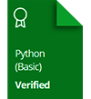
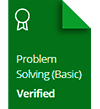

---

## :information_source: Profiles :

---

* [HackerRank](https://www.hackerrank.com/Alaamimi)

* [Leetcode](https://leetcode.com/Alaamimi/)

* [SoloLearn](https://www.sololearn.com/profile/21098635)

---

## :computer: My certificates :

---

---

## :speaker: The legend says :

---

> "Testing leads to failure, and failure leads to understanding."!

---

  

---

## 📚 Languages && Tools:

---

   
   

