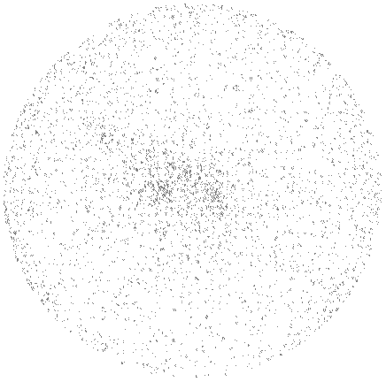
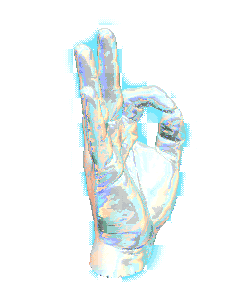

---

	
	
	

---

## ⚙️ &nbsp;GitHub Analytics

---

	
	

---

 

---

 

   
  

---

---

  

---

### :arrow_forward: 42 projects :

---

---

---

<code></code> 
<code></code>   
<code></code>
<code></code>
<code></code>
<code></code>

---
